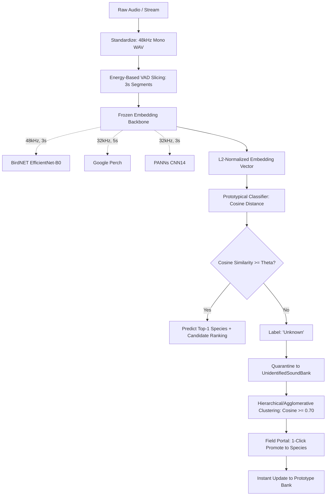

# AnyCall 🐾📡

> **Open-Set, Few-Shot, Cross-Taxa Acoustic Wildlife Classifier for Edge Deployment**

AnyCall is a lightweight, edge-deployable bioacoustic monitoring platform designed to identify wildlife across taxonomic boundaries (birds, insects, amphibians, mammals) using frozen audio embedding backbones and nearest-centroid prototypical classification. It eliminates the need for expensive model retraining, enables rapid field enrollment of new species from a handful of audio samples, and flags/clusters novel, unrecognized sounds into an autonomous mystery sound bank.

[](https://www.python.org/)
[](LICENSE)
[]()
[-orange.svg)]()

---

## 🌟 Key Capabilities

1. **Cross-Taxa Sound Classification**: Outperforms domain-specific models by generalizing across Aves (birds), Insecta (crickets/cicadas), Amphibia (frogs/toads), and Mammalia (jackals, macaques, squirrels).
2. **Few-Shot Prototypical Engine**: Enrolls new species in seconds with as few as 5 audio clips by maintaining unit-normalized centroid vectors with online running-sum updates.
3. **Open-Set Novelty Detection**: Tunable rejection threshold ($\theta$) cleanly rejects out-of-bank sounds instead of hallucinating false positives.
4. **Autonomous Mystery Sound Bank**: Quarantines unrecognized bioacoustic events, clusters recurring unknown signatures (cosine similarity $\ge 0.70$), and allows 1-click promotion to recognized species.
5. **Ultra-Low Edge Footprint**: Single-clip inference latency of **~42.5 ms on CPU** (~340 ms on Raspberry Pi Zero 2W), operating fully offline without internet or cloud dependencies.
6. **Field Control Station & Web Portal**: Zero-CDN web interface with a real-time detection feed, audio dropzone tester, prototype inventory, and mystery sound cluster explorer.

---

## 📊 Benchmark Highlights (Indian Biodiversity Dataset)

Evaluated on 33 resident Indian species (876 cleanly verified 3-second segments):

| Experiment | Metric | Stock BirdNET | AnyCall (BirdNET Backbone) | AnyCall (Google Perch) |
| :--- | :--- | :---: | :---: | :---: |
| **Failure Analysis** | Top-1 Accuracy (5-shot) | 24.5% | **72.4% (+47.9 pp)** | **72.0%** |
| **Few-Shot (K=10)** | Top-1 Accuracy | — | 75.1% | **76.8%** |
| **Few-Shot (K=20)** | Top-1 Accuracy | — | 77.6% | **79.6%** |
| **Insecta (8 spp.)** | Cross-Taxa Top-1 | — | **93.5%** | 89.3% |
| **Amphibia (5 spp.)** | Cross-Taxa Top-1 | — | **93.3%** | 87.5% |
| **Mammalia (5 spp.)** | Cross-Taxa Top-1 | — | **88.0%** | 83.8% |
| **Open-Set Rejection**| Equal Error Rate (EER) | — | **27.4%** ($\theta = 0.66$) | 27.5% ($\theta = 0.40$) |
| **Edge CPU Latency** | Mean Inference Time | — | **42.5 ms** | 127.2 ms |

---

## 🏗️ Architecture



---

## 🚀 Quickstart & Installation

### 1. Prerequisites
- Python 3.11+
- FFmpeg (for audio loading & decoding)

### 2. Setup Virtual Environment
```bash
git clone https://github.com/techiitheblob/anycall.git
cd anycall
python -m venv .venv

# On Windows:
.venv\Scripts\activate
# On Linux/macOS:
source .venv/bin/activate

# Install dependencies
pip install -e .
pip install fastapi uvicorn python-multipart httpx pytest
```

### 3. Launch the Field Control Portal
Start the local, offline-ready web dashboard:
```bash
# Start server on port 8000
python -m anycall.portal.server --port 8000
```
Open your browser at **`http://localhost:8000`**.

---

## 🖥️ Field Control Portal Features

The portal is a zero-dependency single-page application built for offline edge field stations:

- **📊 Live Detections Feed**: Real-time table of all processed audio segments, timestamps, predicted species, taxonomic labels, and cosine confidence scores.
- **🎙️ Audio Classifier & Tester**: Drag-and-drop any WAV/MP3/OGG audio file to see instant VAD segmentation, top-1 prediction, confidence meters, and candidate score rankings.
- **🧬 Enrolled Species Management**: View all enrolled species prototypes, active sample counts, and enroll new species instantly via multi-file audio upload without retraining.
- **🔍 Mystery Sound Explorer**: Inspect quarantined unidentified sounds grouped into recurring acoustic clusters. Play the audio clips and click **"Name & Promote"** to instantly add them to the species bank.
- **⚙️ Field Controls**: Dynamically slide the rejection threshold $\theta$ (0.00 – 1.00) or hot-swap embedding backbones.

---

## 🧪 Running Tests

AnyCall features a comprehensive test suite across unit, contract, and end-to-end integration tiers:

```bash
# Run portal API tests
pytest tests/test_portal_api.py

# Run complete 4-tier E2E test runner (fast mode < 5.0s budget)
python tests/run_e2e_tests.py --fast

# Run complete E2E tests in standard mode
python tests/run_e2e_tests.py
```

---

## 📂 Project Structure

```
anycall/
├── audio/               # Audio standardization & energy-based VAD
│   ├── standardize.py   # Resampling (48kHz), mono conversion, peak normalization
│   └── vad.py           # Adaptive voice/vocalization activity detector
├── data/                # Dataset definitions & harvesting
│   ├── species.py       # 33 resident Indian species metadata
│   └── harvester.py     # Dual-mode Xeno-Canto automated harvester
├── embeddings/          # Unified embedding backbone abstractions
│   ├── base.py          # BaseAudioEmbeddingBackbone ABC
│   ├── birdnet.py       # BirdNET EfficientNet-B0 wrapper
│   ├── perch.py         # Google Perch wrapper
│   ├── panns.py         # PANNs CNN14 wrapper
│   └── mock.py          # Deterministic mock for offline CI
├── classifier/          # Prototypical classification engine
│   ├── prototypical.py  # Cosine nearest-centroid classifier + online updates
│   └── threshold.py     # Decision threshold optimization (EER, FAR/TAR)
├── storage/             # Persistence & state management
│   ├── db.py            # SQLite manager for detections & mystery sounds
│   └── prototype_store.py # Storage for species centroid embeddings
├── portal/              # Field control station & web dashboard
│   ├── api.py           # FastAPI REST endpoints
│   ├── server.py        # CLI server runner
│   └── static/          # Zero-CDN offline HTML/CSS/JS frontend
│       └── index.html   # Bioacoustic dashboard UI
└── benchmark/           # 5-experiment reproducible benchmarking suite
    ├── runner.py        # Automated benchmark runner
    └── profiler.py      # Latency and edge RAM profiler
```

---

## 📜 Target Publication
- **Conference**: Asia-Pacific Bioacoustics and Signal Processing Conference (APSCON 2027)
- **Title**: *AnyCall: Zero-Retraining Cross-Taxa Acoustic Wildlife Identification and Mystery Call Clustering on Edge Hardware*

---

## 📄 License
MIT License. See [LICENSE](LICENSE) for details.
